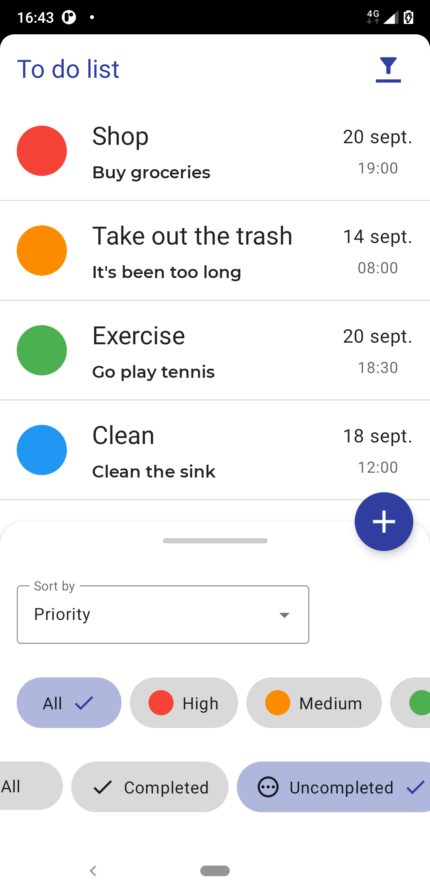
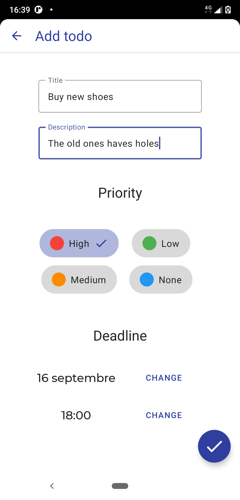
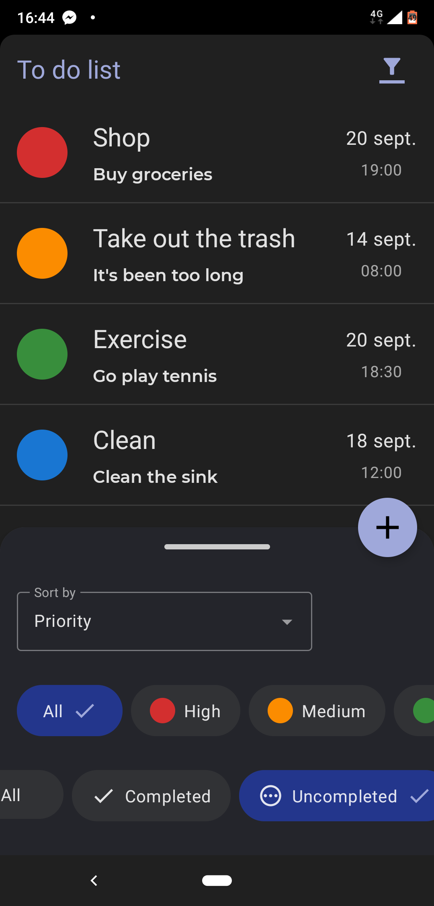

# Todo app Compose

## A Todo app done with the android Compose tool. ✨

This app allows to read, create, update and delete todos.
It also allows to filter and sort todos.

Other features:

* Night mode 🌙
* Transitions between routes
* Swipe to delete todo
* Click and hold to mark todo as done
* Filter for todos is saved in the Shared preferences

Done with the **MVVM** pattern, also uses Kotlin and Flows.

## Compatibility
| data        | value |
|-------------|-------|
| min sdk     | 21    |
| compile sdk | 33    |

## Screenshots

